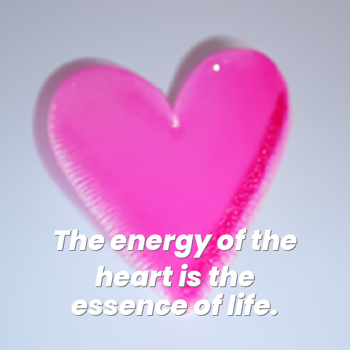
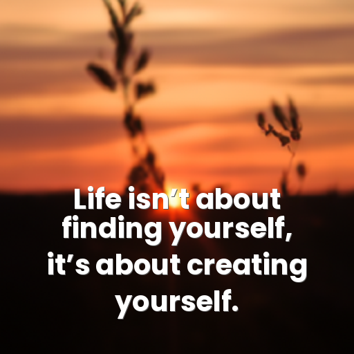

Quotes Slackbot
===============

This project uses [GPT-3](https://openai.com/blog/gpt-3-apps/) to generate (trashy) 
quotes and [GLIDE](https://github.com/openai/glide-text2im) to generate themed images, puts
them together and publishes them in a [Slack](https://www.slack.com) channel. 
The generation of images can be queued via making requests to a HTTP server, the whole application runs serverless in a Docker container.
API keys can be fetched via Google Cloud Secrets (soon).

# Examples

   

*Image propmpts for GLIDE model (also generated by GPT-3, in conjunction with the quote):* snow-covered peak, New York City night, heart open, sunset in summer

# Install

To be added

# Config

To be added

# Idea

Meant as an ironic joke, my manager [@andhus](https://www.github.com/andhus) at [Movesta](https://www.movesta.se) 
started posting motivational quotes every Monday morning on Slack, and after a few weeks, our colleagues started expecting
them. Eventually he got bored of it, so I went on to automate both his 5 minutes of work,
but also the contribution of Instagram influencers aiming to inspire humanity. Deep learning has successfully replaced you. 

# Notes and references

- This project has been set up using PyScaffold 4.1.4. For details and usage 
information on PyScaffold see https://pyscaffold.org/.
- GLIDE code used in this project originally from https://github.com/openai/glide-text2im
